# AZ-204T00_MOD08_LAK_Starter

JOSE VICENTE TEJERO - 18/01/2021

RESUMEN
Lab: Creating a multi-tier solution by using services in Azure

Student lab answer key

Microsoft Azure user interface

Given the dynamic nature of Microsoft cloud tools, you might experience Azure UI changes after the development of this training content. These changes might cause the lab instructions and steps to not match up.

Microsoft updates this training course when the community brings needed changes to our attention. However, because cloud updates occur frequently, you might encounter UI changes before this training content updates. **If this occurs, adapt to the changes, and then work through them in the labs as needed.**

Instructions

Exercise 1: Creating an Azure App Service resource by using a Docker container image

Task 1: Open the Azure portal

1. On the     taskbar, select the **Microsoft Edge** icon.
2. In the     open browser window, go to the Azure portal ([https://portal.azure.com](https://portal.azure.com/)).
3. At the     sign-in page, enter the email address for your Microsoft account, and then     select **Next**.
4. Enter     the password for your Microsoft account, and then select **Sign in**.

**Note**: If this is your first time signing in to the Azure portal, you will be offered a tour of the portal. Select **Get Started** to skip the tour and begin using the portal.

Task 2: Create a web app by using Azure App Service resource by using an httpbin container image

1. In the     Azure portal’s navigation pane, select **Create a resource**.
2. From     the **New** blade, find the **Search the Marketplace** text     box.
3. In the     search box, enter **Web**, and then select Enter.
4. From     the **Marketplace** search results blade, select the **Web     App** result.
5. From     the **Web App** blade, select **Create**.
6. From     the second **Web App** blade, find the tabs from the blade,     such as **Basics**.

**Note**: Each tab represents a step in the workflow to create a new web app. You can select **Review + Create** at any time to skip the remaining tabs.

1. From     the **Basics** tab, perform the following actions:

1. 1. Leave      the **Subscription** text box set to its default value.
   2. In the **Resource      group** section, select **Create new**, enter **ApiService**,      and then select **OK**.
   3. In      the **Name** text box, enter **httpapi\*[yourname]\***.
   4. In      the **Publish** section, select **Docker Container**.
   5. In      the **Operating System** section, select **Linux**.
   6. In      the **Region** drop-down list, select the **East US** region.
   7. In      the **Linux Plan (East US)** section, select **Create      new**, enter the value **ApiPlan** in the **Name** text      box, and then select **OK**.
   8. Leave      the **SKU and size** section set to its default value.
   9. Select **Next:      Docker**.

2. From the **Docker** tab,     perform the following actions:

1. 1. In      the **Options** drop-down list, select **Single      Container**.
   2. In      the **Image Source** drop-down list, select **Docker      Hub**.
   3. In      the **Access Type** drop-down list, select **Public**.
   4. In      the **Image and tag** text box, enter **kennethreitz/httpbin:latest**.
   5. Select **Review      + Create**.

2. From     the **Review + Create** tab, review the options that you     selected during the previous steps.

3. Select **Create** to     create the web app by using your specified configuration.

**Note**: Wait for the creation task to complete before you move forward with this lab.

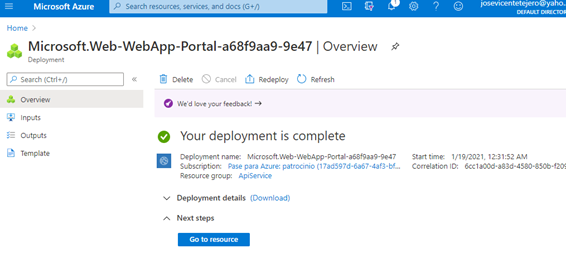

Task 3: Test the httpbin web application

1. In the     Azure portal’s navigation pane, select **Resource groups**.
2. From     the **Resource groups** blade, select the **ApiService** resource     group that you created earlier in this lab.
3. From     the **ApiService** blade, select the **httpapi\*[yourname]\*** web     app that you created earlier in this lab.
4. From     the **Web App** blade, select **Browse**.
5. Within     the web application, perform the following actions:

1. 1. Select **Response      formats**.
   2. Select **GET      /xml**.
   3. Select **Try      it out**.
   4. Select **Execute**.
   5. Observe      the value of the **Response body** and **Response      headers** text boxes.
   6. Observe      the value of the **Request URL** text box.

1. Close     the browser window for the web application.
2. Find     the **Web App** blade for the **httpapi\*[yourname]\*** web     app back in the Azure portal.
3. From     the **Web App** blade, in the **Settings** section,     select the **Properties** link.
4. In     the **Properties** section, record the value of the **URL** text     box. You’ll use this value later in the lab to make requests against the     API.

URL

[httpapijvtc.azurewebsites.net](http://httpapijvtc.azurewebsites.net/)

Review

In this exercise, you created a new Azure web app by using a container image sourced from Docker Hub.

Exercise 2: Build an API proxy tier by using Azure API Management

Task 1: Create an API Management resource

1. In the    Azure portal’s navigation pane, select **Create a resource**.
2. From    the **New** blade, find the **Search the Marketplace** text    box.
3. In the    search box, enter **API**, and then select Enter.
4. From    the **Marketplace** search results blade, select the **API    Management** result.
5. From    the **API Management** blade, select **Create**.
6. From    the **API Management Service** blade, perform the following    actions:

1. 1. In     the **Name** text box, enter **prodapi\*[yourname]\***.
   2. Leave     the **Subscription** text box set to its default value.
   3. In     the **Resource group** list, select the **ApiService** group     that you created earlier in the lab.
   4. In     the **Location** list, select **East US**.
   5. In     the **Organization name** text box, enter **Contoso**.
   6. Leave     the **Administrator email** text box set to its default     value.
   7. In     the **Pricing tier** list, select **Consumption (99.9 SLA,     %)**.
   8. Select **Create**.

**Note**: Wait for the creation task to complete before you move forward with this lab.

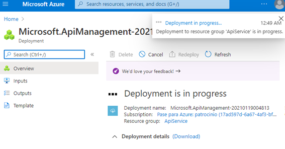

Task 2: Define a new API

1. In the    Azure portal’s navigation pane, select **Resource groups**.
2. From    the **Resource groups** blade, select the **ApiService** resource    group that you created earlier in this lab.
3. From    the **ApiService** blade, select the **prodapi\*[yourname]\*** API    Management account that you created earlier in this lab.
4. From    the **API Management Service** blade, in the **API    Management** section, select **APIs** .
5. In    the **Add a new API** section, select **Blank API**.
6. In    the **Create a blank API** window, perform the following    actions:

1. 1. In     the **Display name** text box, enter **HTTPBin API**.
   2. In     the **Name** text box, enter **httpbin-api**.
   3. In     the **Web service URL** text box, enter the URL for the web     app that you copied earlier in this lab.

**Note**: Depending on how you copy the URL, you might need to add an “http://” prefix to create a valid URL value.

1. 1. Leave     the **API URL suffix** text box empty.
   2. Select **Create**.

**Note**: Wait for the new API to finish being created.

1. From    the **Design** tab, select **Add operation**.
2. In    the **Add operation** section, perform the following actions:

1. 1. In     the **Display name** text box, enter **Echo Headers**.
   2. In     the **Name** text box, enter **echo-headers**.
   3. In     the **URL** list, select **GET**.
   4. In the **URL** text     box, enter **/**.
   5. Select **Save**.

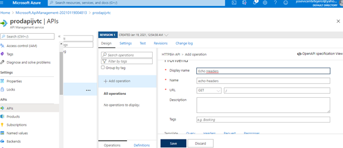

1. Back    from the **Design** tab, in the list of operations,    select **All Operations**.
2. In    the **Design** section for **All Operations**, find    the **Inbound processing** tile, and then select **Add    policy**.
3. In    the **Add inbound policy** section, select the **Set    headers** tile.
4. In    the **Inbound processing, Set Headers** section, perform the    following actions:

1. 1. In     the **Name** text box, enter **source**.
   2. In     the **Value** text box, select the list, select **Add     Value**, and then enter **azure-api-mgmt**.
   3. In     the **Action** list, select **append**.
   4. Select **Save**.

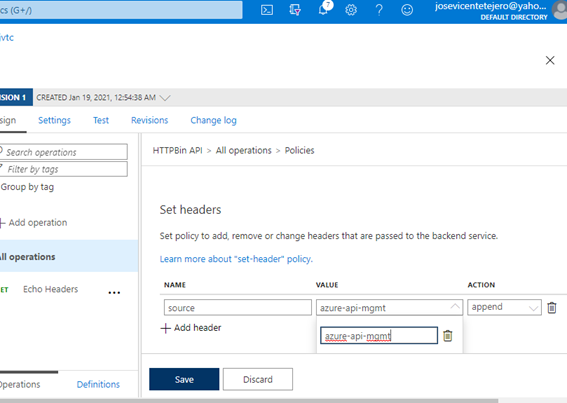

1. Back    from the **Design** tab, in the list of operations,    select **Echo Headers**.
2. In    the **Design** section for **Echo Headers**, find    the **Backend** tile, and then select the pencil icon.
3. In    the **Backend** section, perform the following actions:

1. 1. In the **Service     URL** section, select the **Override** check box.
   2. In     the **Service URL** text box, append the value **/headers** to     its current value.

**Note**: For example, if the current value is **http://httpapi\*[yourname]\*.azurewebsites.net**, the new value will be **http://httpapi\*[yourname]\*.azurewebsites.net/headers**

1. 1. Select **Save**.

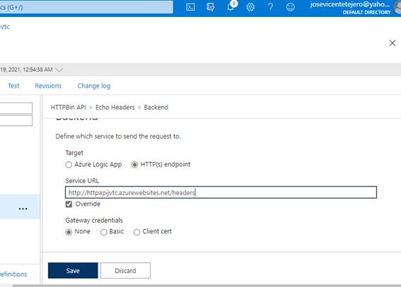

1. Back    from the **Design** tab, in the list of operations,    select **Echo Headers**.
2. From    the **Test** tab, select the **Echo Headers** operation.
3. In    the **Echo Headers** section, select **Send**.
4. Observe    the results of the API request.

**Note**: Observe how there’s many headers sent as part of your request that are echoed in the response. Specifically, you’ll notice the new **Source** header that you created as part of this task.

 

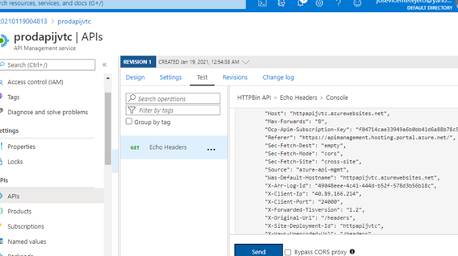

1. Select    the **Design** tab to return to the list of operations.

Task 3: Manipulate an API response

1. From    the **Design** tab, select **Add operation**.
2. In    the **Add operation** section, perform the following actions:

1. 1. In     the **Display name** text box, enter **Get Legacy Data**.
   2. In     the **Name** text box, enter **get-legacy-data**.
   3. In     the **URL** list, select **GET**.
   4. In     the **URL** text box, enter **/xml**.
   5. Select **Save**.

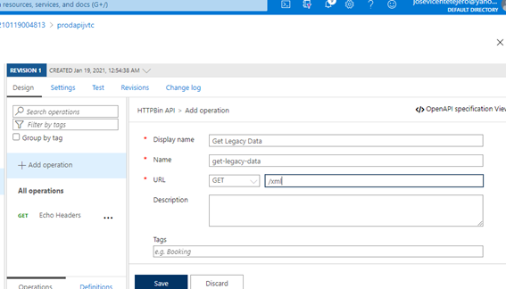

1. Back    from the **Design** tab, in the list of operations,    select **Get Legacy Data**.
2. From    the **Test** tab, select the **Get Legacy Data** operation.
3. In    the **Get Legacy Data** section, select **Send**.

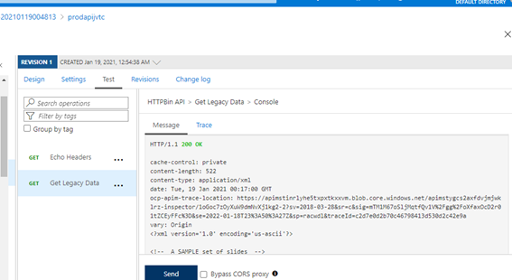

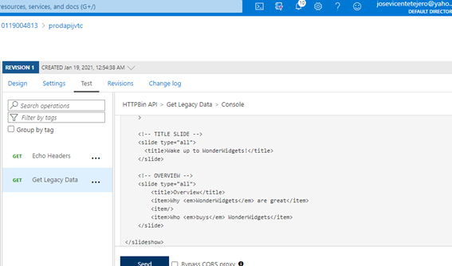

1. Observe    the results of the API request.

**Note**: At this point, the results should be in XML format.

1. Back    from the **Design** tab, in the list of operations,    select **Get Legacy Data**.
2. In    the **Design** section for the **Get Legacy Data** operation,    find the **Outbound processing** tile, and then select **Add    policy**.
3. In    the **Add outbound policy** section, select the **Other    policies** tile.
4. In the    policy code editor, find the following block of XML content:

CodeCopy

<outbound>

  <base />

</outbound>

1. Replace    that block of XML with the following XML:

CodeCopy

<outbound>

  <base />

  <xml-to-json kind="direct" apply="always" consider-accept-header="false" />

</outbound>

1. In the    policy code editor, select **Save**.

1. Back    from the **Design** tab, in the list of operations,    select **Get Legacy Data**.
2. From    the **Test** tab, select the **Get Legacy Data** operation.
3. In    the **Get Legacy Data** section, select **Send**.
4. Observe    the results of the API request.

**Note**: The new results are in JavaScript Object Notation (JSON) format.

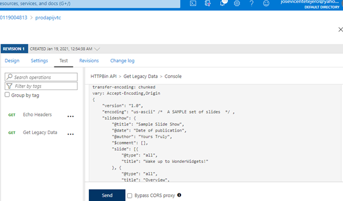

1. Within    the **HTTP response** section, perform the following actions:

1. 1. Select **Trace**.
   2. Observe     the content in the **Backend** and **Outbound** text     boxes.

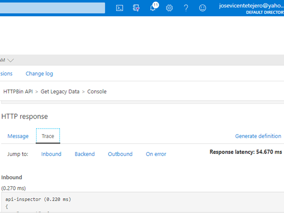

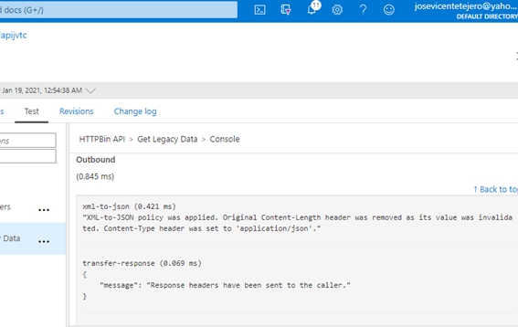

Review

In this exercise, you built a proxy tier between your App Service resource and any developers who wish to make queries.

Exercise 3: Clean up your subscription

Task 1: Open Azure Cloud Shell

1. In the    Azure portal’s navigation pane, select the **Cloud Shell** icon    to open a new shell instance.

**Note**: The **Cloud Shell** icon is represented by a greater than sign (>) and underscore character (_).

1. If this    is your first time opening Cloud Shell using your subscription, you can use    the **Welcome to Azure Cloud Shell Wizard** to configure Cloud    Shell for first-time usage. Perform the following actions in the wizard:

2. - A     dialog box prompts you to create a new storage account to begin using the     shell. Accept the default settings, and then select **Create storage**.

**Note**: Wait for Cloud Shell to finish its initial setup procedures before moving forward with the lab. If you don’t notice Cloud Shell configuration options, this is most likely because you’re using an existing subscription with this course’s labs. The labs are written with the presumption that you’re using a new subscription.

Task 2: Delete resource groups

1. Enter    the following command, and then select Enter to delete the **ApiService** resource    group:

CodeCopy

az group delete --name ApiService --no-wait --yes

1. Close    the Cloud Shell pane in the portal.
2.  
3. 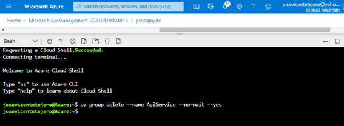

Task 3: Close the active applications

- Close    the currently running Microsoft Edge application.

Review

In this exercise, you cleaned up your subscription by removing the resource groups used in this lab.

 

PROBLEMAS
No
